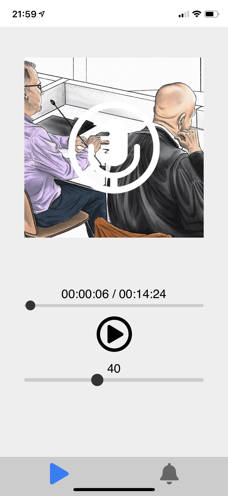

# Podcastpy

A podcast player for a raspberry pi. Frontend written with Elm, backend in Python 3.

The interface has been designed as a PWA for iOS. It has not been tested with Android.

## Building
`make build`: Builds the frontend & copies the backend to `./build` along with a `requirements.txt`

## Future work
* Allow the podcast played to be configurable
    * Requires adding another page to the frontend
    * Requires work on the backend
* Improve deployment process
* Make the frontend reactive so it makes better use of screen space on non-phones